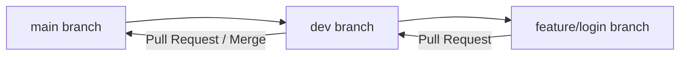

# TASK 4: Version-Controlled DevOps Project with Git

## 📌 Objective
Manage a DevOps project using Git best practices, including branching strategies (`main`, `dev`, `feature`), pull requests, `.gitignore`, version tagging, and documentation.

---

## 🛠 Branching Strategy (Hint a)
This project follows GitFlow best practices:
- **`main`**: Production-ready release code.
- **`dev`**: Integration branch for upcoming features.
- **`feature/login`**: Feature branch for developing individual features.



---

## 🚀 Step-by-Step Execution Walkthrough

### 1. Initialize Repository & Create `.gitignore` (Hint d)
```bash
git init
git add .
git commit -m "initial: setup project structure with README and gitignore"
```

### 2. Create `dev` and `feature` Branches (Hint a)
```bash
# Create and switch to dev branch
git checkout -b dev

# Create feature branch from dev
git checkout -b feature/login
```

### 3. Make Changes & Commit on Feature Branch
```bash
git add .
git commit -m "feat: add user login function"
```

### 4. Push Branches to GitHub
```bash
git push -u origin main
git push -u origin dev
git push -u origin feature/login
```

### 5. Create Pull Request & Merge (Hint b)
1. On GitHub, create a **Pull Request (PR)** to merge `feature/login` ➡️ `dev`.
2. Review and click **Merge Pull Request**.
3. Create a second **Pull Request** to merge `dev` ➡️ `main`.

### 6. Create Git Release Tag (Hint d)
```bash
git checkout main
git tag -a v1.0.0 -m "Release Version 1.0.0"
git push origin v1.0.0
```

---

## 📄 Project Deliverables
- `app.js`: Main application logic.
- `package.json`: Project manifest.
- `.gitignore`: Ignore rules for node_modules and logs.
- `README.md`: Project documentation.
- `INTERVIEW_QUESTIONS.md`: Answers to all 8 Git interview questions.
